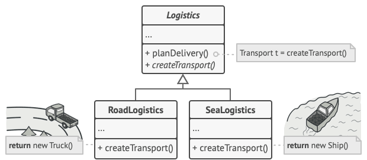
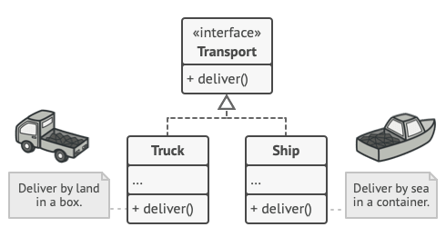
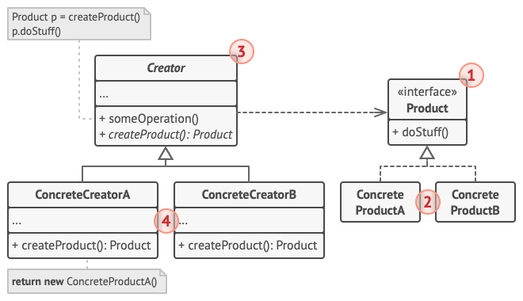
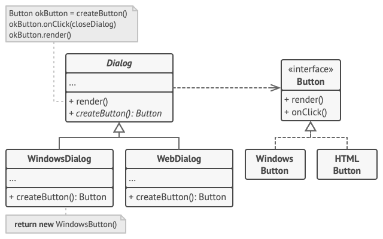

Also Known as **Virtual Constructor**

Define um método para criar objetos, deixando as subclasses decidir qual classe concreta será instanciada.

O ponto essencial é:

Creator → declara Factory Method → ConcreteCreator decide o ConcreteProduct.

Problema:
- Aplicação Logistica inicialmente terrestre - Truck Class
- Necessidade expandir marítima - Ship Class

A maior parte do cógido está acoplada á Truck Class.
Adicionar Ship Class exige alterações a toda a base de código.

O objetivo do padrão é permitir que o código trabalhe com: Transport em vez de Truck.

### Exemplos nas Java Core Libraries

- [`java.util.Calendar#getInstance()`](http://docs.oracle.com/javase/8/docs/api/java/util/Calendar.html#getInstance--)
- [`java.util.ResourceBundle#getBundle()`](http://docs.oracle.com/javase/8/docs/api/java/util/ResourceBundle.html#getBundle-java.lang.String-)
- [`java.text.NumberFormat#getInstance()`](http://docs.oracle.com/javase/8/docs/api/java/text/NumberFormat.html#getInstance--)
- [`java.nio.charset.Charset#forName()`](http://docs.oracle.com/javase/8/docs/api/java/nio/charset/Charset.html#forName-java.lang.String-)
- [`java.util.EnumSet#of()`](https://docs.oracle.com/javase/8/docs/api/java/util/EnumSet.html#of\(E\))
- [`javax.xml.bind.JAXBContext#createMarshaller()`](https://docs.oracle.com/javase/8/docs/api/javax/xml/bind/JAXBContext.html#createMarshaller--) and other similar methods.

**Identification:** Factory methods can be recognized by creation methods that construct objects from concrete classes. While concrete classes are used during the object creation, the return type of the factory methods is usually declared as either an abstract class or an interface.

**Solução:**
Substituir chamadas diretas à construção de objetos por chamadas a um método de fábrica específico. Os objetos são criados através de `new`, mas é chamado dentro do método da fábrica. Os objetos devolvidos são chamados ==produtos==.




Pode sobrescrever o método da fabrica numa subclasse e alterar a classe dos produtos que estão a ser criados. Limitação as subclasses pode devolver tipos de produtos diferentes se tiverem uma classe base ou interface comum.



Truck e Ship implementam Transport que declara `deliver`. Cada classe implementa de forma diferente, Truck por terra e Ship por mar.

O código cliente não vê a diferença dos produtos devolvidos.
Trata todos os produtos como abstratos. O cliente sabe que todos os objetos têm o método `deliver`, mas o funcionamento não é importante para o cliente.

## Estrutura


- `Product` → produto abstrato
- `ConcreteProduct` → produto concreto
- `Creator` → criador
- `ConcreteCreator` → criador concreto

1. `Product` declara a interface, comum a todos os objetos que podem ser produzidos e subclasses
2. Produtos concretos
3. A classe `Creator` declara o método de fábrica que devolve novos objetos de produto. Método de retorno corresponde à interface do produto.

   Método de fabrica para abstract para forçar subclasses a implementarem.
   A classe `Creator` já tem alguma lógica de negócio relacionada ao produto.

   Analogia: Empresa de SW pode ter departamento de treino. A função principal da empresa como um todo é escrever código, não formar programadores.
4. `ConcreteCreator` substituem o método de fábrica base.


## Pseudocódigo



---

**"Factory Method vs Simple Factory"**

**Simple Factory**

````
Transport createTransport(String type) {
    if (type.equals("truck")) {
        return new Truck();
    }

    if (type.equals("ship")) {
        return new Ship();
    }

    ...
}
````

Factory Method, a decisão é delegada para subclasses

```text
Logistics
   |
   +-- createTransport()
          ↑
     ┌────┴────┐
TruckLogistics  ShipLogistics
     |               |
  Truck             Ship
```

---

## Aplicabilidade

Problema:
Utilizar quando não se souber antemão os tipos exatos e as dependências dos objetos com os quais o código deve trabalhar.

Solução: O método de fábrica separa o código de construção do produto do código que efetivamente utiliza o produto. Para adicionar novo tipo de produto, só é necessário criar uma nova subclasse de criador e sobscrever o método de fábrica.

--- 

Problema: Quando for para fornecer aos utilizadores da biblioteca ou framework uma maneira de estender seus componentes internos.

Solução: Herança, maneira mais fácil de estender o comportamento padrão de uma biblioteca ou framework. Mas como o framework reconheceria que sua subclasse deve ser usada em vez de um componente padrão?

A solução é reduzir o código que constroi componetes em toda a estrutura a um único método de fábrica e permitir que qualquer pessoa subscreva esse método, além de estender o próprio componente.

Ex. Aplicação usando framework de código aberto. Botões redondos em vez de botões quadrados. Estender Class Padrão Button com uma Subclasse RoundButton. Instruir UIFramework a usar a nova subclasse em vez da padrão.

Criar uma classe UIWithRoundButtons a partir de uma classe base do framework e sobresve o médodo createButton. Enquanto esse método devolve objetos Button na classe base, faz com que a subclasse devolva RoundButton. Agora usar UIWithRoundButtons em vez de UIFrameWork

--- 

Problema: Quando desejar economizar recursos do sistema reutilizando objetos existentes em vez de criá-los a cada vez.

Solução:


## Como implementar

Problema:

Logistics
↓
Truck

A `Logistics` está diretamente dependente de `Truck`.

O Factory Method vai transformar:

Logistics
↓
Transport
↑
┌──┴────┐
Truck   Ship

1. Fazer com que todos os produtos sigam a mesma interface

````
interface Transport {
    void deliver();
}

class Truck implements Transport {

    @Override
    public void deliver() {
        System.out.println("Entrega por terra.");
    }
}

class Ship implements Transport {

    @Override
    public void deliver() {
        System.out.println("Entrega por mar.");
    }
}
````

2. Adicionar o Factory Method à classe criadora

Antes:
````
class Logistics {

    public void planDelivery() {
        Truck truck = new Truck();
        truck.deliver();
    }
}
````

Depois:
````
class Logistics {

    public Transport createTransport() {
        return new Truck();
    }

    public void planDelivery() {
        Transport transport = createTransport();
        transport.deliver();
    }
}
````

3. Criar subclasses do Creator

````
class RoadLogistics extends Logistics {

    @Override
    public Transport createTransport() {
        return new Truck();
    }
}

class SeaLogistics extends Logistics {

    @Override
    public Transport createTransport() {
        return new Ship();
    }
}
````

4. E o `switch` mencionado pelo tutorial?

````
class Logistics {

    public Transport createTransport(String type) {

        switch (type) {
            case "truck":
                return new Truck();

            case "ship":
                return new Ship();

            default:
                throw new IllegalArgumentException();
        }
    }
}
````

5. Tornar o Factory Method `abstract`

````
abstract class Logistics {

    public abstract Transport createTransport();

    public void planDelivery() {
        Transport transport = createTransport();
        transport.deliver();
    }
}

class RoadLogistics extends Logistics {

    @Override
    public Transport createTransport() {
        return new Truck();
    }
}

class SeaLogistics extends Logistics {

    @Override
    public Transport createTransport() {
        return new Ship();
    }
}
````

Ideia Chave: **A classe base define a lógica que usa o produto; as subclasses decidem qual produto concreto criar.**

```text
                         CLIENTE
                            |
                            ↓
                    Logistics
                    <<abstract>>
                            |
                            | planDelivery()
                            ↓
                    createTransport()
                            ↑
                 ┌──────────┴──────────┐
                 │                     │
                 │ override            │ override
                 ↓                     ↓
         RoadLogistics            SeaLogistics
                 |                     |
                 | creates             | creates
                 ↓                     ↓
              Truck                  Ship
           <<product>>             <<product>>
                 |                     |
                 └──────────┬──────────┘
                            |
                            ↓
                        Transport
                       <<interface>>
                            |
                            ↓
                         deliver()
```

É precisamente aqui que o **Factory Method** se distingue de simplesmente criar uma classe `Factory`: **a criação é polimórfica através da herança**.